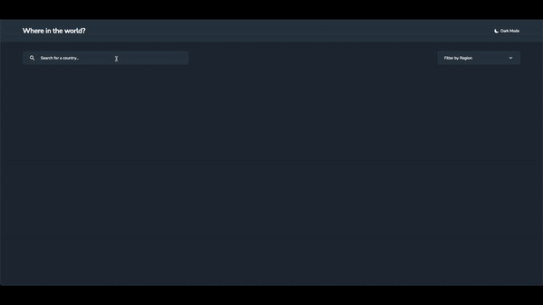

# Listing and Filtering the Country list - Mayd Code Challenge

This is a list application and it is created to show coding skills to the Mayd (company). The Client-side is developed using React.js, and the backend-side is created with Node.js (Express.js).

I put Express.js between the client and the API server because the API server is not accepting requests from the browser.

Created the project using Typescript and Redux(Thunk). 

Wrote unit tests for the project components using Jest and Enzyme libraries.

Used the Tailwind, in order to, create responsive designs. I used Tailwind because it is really easy to use and it increases the readability of the codes.

Also added Webpack and Babel, in order to increase the appliction performance.

Added Eslint, and Prettier. Also, added Husky in order to prevent pushing badly formatted codes.

Also Dockerized all applications.

## Table of Contents
- [Project Overview](#projectoverview)
- [Installation](#installation)
- [Test](#test)
- [Structure](#structure)
- [Support](#support)
- [Contributing](#contributing)


### ProjectOverview

A short overview of the project



## Installation
### with Docker
```sh
git clone https://github.com/mJiyan/typescript-list-filter-countries.git
cd typescript-list-filter-countries
docker-compose up --build
-> Open your browser at http://0.0.0.0:8080 
```

### manually
```sh
git clone https://github.com/mJiyan/typescript-list-filter-countries.git
cd typescript-list-filter-countries/server
yarn
yarn start

cd typescript-list-filter-countries/client
yarn
yarn start
Open your browser at http://0.0.0.0:8080 
```


## Test
```sh
git clone https://github.com/mJiyan/typescript-list-filter-countries.git
cd typescript-list-filter-countries/server
yarn
yarn test

cd typescript-list-filter-countries/client
yarn
yarn test
```


## Structure
```
├─ client
│   ├─ __test__
│   │  ├─ setup
│   │  │  └─ setupTest.js
│   │  ├─ Components
│   │  └─ Mock
│   ├─ .huksy
│   │  ├─ pre-commit
│   │  └─ pre-push
│   ├─ public
│   │  └─ index.html
│   │
│   ├─ src
│   │  ├─ assets
│   │  │  └─ style
│   │  │     └─ tailwind.css
│   │  │
│   │  ├─ components
│   │  │  ├─ BackButton
│   │  │  │  └─ index.tsx
│   │  │  ├─ BorderCountry
│   │  │  │  └─ index.tsx
│   │  │  ├─ BorderCountryList
│   │  │  │  └─ index.tsx
│   │  │  ├─ Card
│   │  │  │  └─ index.tsx
│   │  │  ├─ CardList
│   │  │  │  └─ index.tsx
│   │  │  ├─ CountryDetails
│   │  │  │  └─ index.tsx
│   │  │  ├─ CountryInformations
│   │  │  │  └─ index.tsx
│   │  │  ├─ Filter
│   │  │  │  └─ index.tsx
│   │  │  ├─ Flag
│   │  │  │  └─ index.tsx
│   │  │  ├─ Header
│   │  │  │  └─ index.tsx
│   │  │  └─ index.tsx
│   │  │
│   │  ├─ models
│   │  │  ├─ BorderCountry
│   │  │  │  └─ index.tsx
│   │  │  ├─ BorderCountryList
│   │  │  │  └─ index.tsx
│   │  │  ├─ Card
│   │  │  │  └─ index.tsx
│   │  │  ├─ CardList
│   │  │  │  └─ index.tsx
│   │  │  ├─ Countries
│   │  │  │  └─ index.tsx
│   │  │  ├─ Country
│   │  │  │  └─ index.tsx
│   │  │  ├─ CountryDetails
│   │  │  │  └─ index.tsx
│   │  │  ├─ CountryInformations
│   │  │  │  └─ index.tsx
│   │  │  ├─ Filter
│   │  │  │  └─ index.tsx
│   │  │  ├─ Flag
│   │  │  │  └─ index.tsx
│   │  │  └─ index.tsx
│   │  │
│   │  ├─ config
│   │  │  └─ routes.ts
│   │  │
│   │  ├─ redux
│   │  │  ├─ actions
│   │  │  │  └─ Country
│   │  │  │     ├─ index.ts
│   │  │  │     └─ types.ts
│   │  │  └─ reducers     
│   │  │     ├─ Country
│   │  │     │   └─ index.ts
│   │  │     └─ index.ts
│   │  │
│   │  ├─ services
│   │  │  ├─ api.ts
│   │  │  ├─ utils.ts
│   │  │  └─ constants.ts
│   │  │
│   │  ├─ views
│   │  │  ├─ Countries
│   │  │  │  └─ index.tsx
│   │  │  ├─ Country
│   │  │  │  └─ index.tsx
│   │  │  └─ index.tsx
│   │  │
│   │  ├─ react-app-env.d.ts
│   │  ├─ App.tsx
│   │  ├─ index.tsx
│   │  └─ Store.ts
│   │
│   ├─ .dockerignore
│   ├─ .eslintrc
│   ├─ .gitignore
│   ├─ .prettierrc
│   ├─ babel.config.js
│   ├─ Dockerfile
│   ├─ jest.config.js
│   ├─ LICENSE
│   ├─ postcss.config.js
│   ├─ tailwind.config.js
│   ├─ tsconfig.json
│   ├─ package.json
│   └─ webpack.config.js
│
│
├─ server
│   ├─ src
│   │  ├─ api
│   │  │  ├─ controllers
│   │  │  │  └─ countriesController.js
│   │  │  └─ routes
│   │  │     ├─ countriesRoutes.js
│   │  │     └─ routeManager.js
│   │  ├─ config
│   │  │  └─ index.js
│   │  ├─ loaders
│   │  │  ├─ express.js
│   │  │  └─ index.js
│   │  └─ app.js
│   ├─ __test__
│   │  └─ api
│   │     ├─ controllers
│   │     │  ├─ country.test.js
│   │     │  └─ index.test.js
│   │     └─ helpers
│   │        └─ test.model.json
│   ├─ .dockerignore
│   ├─ .env
│   ├─ .gitignore
│   ├─ Dockerfile
│   ├─ LICENSE
│   └─ package.json
├─ docker-compose.yml
└─ README.md
```

## Support

Please [open an issue](https://github.com/mJiyan/typescript-list-filter-countries/issues) for support & suggestions.


## Contributing

Please contribute using [Github Flow](https://guides.github.com/introduction/flow/). Create a branch, add commits, and [open a pull request](https://github.com/mJiyan/typescript-list-filter-countries/compare).